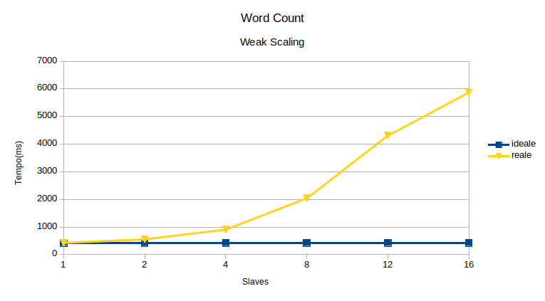
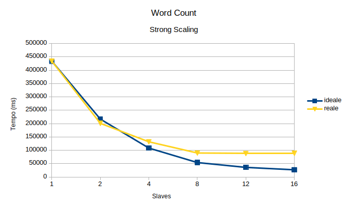

# WORD COUNT
Questo programma effettua un word count parallelo usando __MPI__ ed esclusivamente comunicazione collettiva.

## Requisiti
- Ambiente Unix Like
- Libreria MPI installata
- Make installato

## Instruzioni Compilazione
Posizionarsi nella directory del progetto ed eseguire
`make`

## Istruzioni Esecuzione
posizionarsi nella directory del progetto ed eseguire
`mpirun -np <slaves> ./WordCount <path>`
dove:

slaves: è il numero di processi: Deve essere eseguito a partire da n >= 2  (1 processo master ed n - 1 slave)
path: è una path relativa o assolta alla directory contentente i file di test escludendo lo slash finale.

Esempio: contare le parole di tutti i file presenti nella directory strong_scaling con un master ed uno slave (assumendo di trovarsi nella directory del progetto):

`mpirun -np 2 ./WordCount ./test/strong_scaling`


## Table of Contents
1. [Algoritmo](#algoritmo)
2. [Benchmark](#benchmark)
    1. [Weak Scaling](#weak-scaling)
    2. [Strong Scaling](#strong-scaling)
3. [Ringraziamenti](#ringraziamenti)

## Algoritmo
La risoluzione di questo problema è stata effettuata cercando di simulare il paradigma __Map/Reduce__. L'architettura di questo programma è del tipo master/slave dove ogni macchina utilizza la seguente struttura per manipolare le informazioni:

```c
typedef struct
{
  line_t *task_lines; //array di linee
  word_t *task_words; //array di parole
  int line_size; //size totale vettore linee
  int word_size; //size totale vettore parole
  int lines_used; //size utilizzata dal vettore linee
  int words_used; //size utilizzata dal vettore parole
}task_t;
```
Ed è composta da 4 Fasi:

### Fase di Split
Il master riceve in input una path, assoluta o relativa, di una directory e scansiona tutti i file (ecludento path 'speciali' come ad esempio file nascosti) e conta le linee totali. Le linee sono mappate all'interno di un ADT che ha questa struttura:
```c
typedef struct
{
    char file[PATH_LENGTH]; //path di ogni file
    unsigned long start; //offset inizio linea
    unsigned long end; //offset fine linea
}line_t;
```
Le linee sono raccole all'interno di un array e mandate ad ogni processore con la funzione __MPI_Scatterv__ Per inviare porzioni non contigue di memoria è stata usata la funzione __MPI_create_struct__. 

### Fase di Map
Gli slave, una volta ricevute le linee da processare, eseguono la funzione __map__ che tokenizza le linee secondo i delimitatori definiti nella macro __TOKENIZER__ ed estrae le parole in un ADT di questo tipo:
```c
typedef struct
{
    char word[MAX_WORD_CHARS]; // parola
    int frequency; // frequenza
} word_t;
```
Che vengono aggiunge ad un array.

### Fase di Combiner
Ogni slave effettua localmente il conteggio del proprio array di parole e il risultato viene trasferito in un nuovo array più compatto.

### Fase di Reduce
Ogni slave manda al master il proprio array con la funzione __MPI_Gatherv__ e quest'ultimo usa la funzione __reduce__ per calcolare le frequenze totali che ridirige sullo standard output. Anche in questo caso per inviare porzioni di memoria con contigue è stato utilizzato __MPI_create_struct__.


## Benchmark
Sono stati effettuati i benchmark con la seguente configurazione:

### Hardware

| Numero Istanze | VCore per istanza | RAM per istanza | Storage SSD per istanza | Larghezza di banda EBS dedicata(Mb/s) |
|----------------|-------------------|-----------------|-------------------------|---------------------------------------|
|8               |2                  |8                |Solo EBS                 |450                                    |

### Software

| Sistema Operativo | Versione OpenMPI | Versione GCC |
|-------------------|------------------|--------------|
| Ubuntu 12.04      |1.4.3             |4.6.3         |

N.B: Se le immagini non si vedono sono presenti nella cartella __img__

## Weak Scaling
Un test di tipo weak scaling, fissa l'ammontare di lavoro per processore e confronta i tempi di esecuzione all'aumentare dei processori. Essendo che ogni processore ha lo stresso carico di lavoro, il tempo ideale dovrebbe rimanere costante. In questo benchmark è stato tenuto un carico di lavoro costante pari a 1000 linee per ogni slave e confrontato con il tempo ideale (tempo di esecuzione di 1 master e 1 slave ) ottenendo i seguenti risultati:



Dal grafico si nota che all'aumentare dei processori il tempo di esecuzione dell'algoritmo aumenta e questo è dovuto al fatto che la sezione di codice sequenziale risulta richiedere più tempo della sezione parallela in quanto un aumento delle linee da processare comporta dei tempi maggiori da parte del master di leggere tutte le linee e inviare le porzioni necessarie ai rispettivi slave.

## Strong Scaling
Un test di tipo strong scaling, fissata la taglia del problema, calcola le prestazioni all'aumentare dei processori. In questo benchmark sono stati presi in consideraizone un insieme di 10 file testuali la cui grandezza totale è pari a 5MB e il tempo ideale è stato preso considerando il tempo di esecuzione di 1 master e di 1 slave, dividendolo per il numero degli slave ad ogni esecuzione. I risultati sono i seguenti:



Dal grafico risulta che il programma implementato ha dei tempi di esecuzione maggiori del tempo ideale, in quanto bisogna considerare 2 fattori chiave che inficiano sulle prestazioni del programma:

1. __Overhead dovuto alla comunicazione:__ Il master spedisce prima le size di cui ogni slave ha bisogno per allocare il vettore delle linee con una Scatter e poi usa una Scatterv per spedire le porzioni di linee. Durante la fase di reduce totale avviene il processo inverso ovvero riceve, tramite una Gather, dagli slave le size di ogni combiner task per allocare un vettore di adeguate dimensioni e con una Gatherv i rispettivi vettori di parole.
2. __Latenza della rete__

## Ringraziamenti
Si ringrazia il sito del progetto Gutemberg per i file testuali con cui effettuare i test.